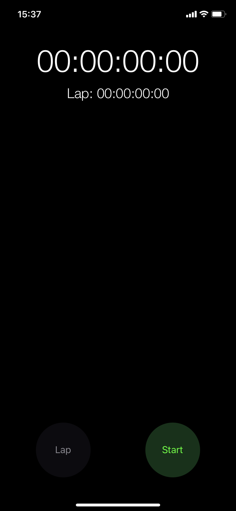
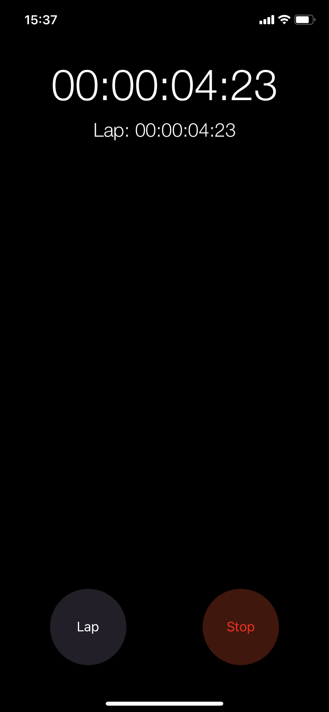
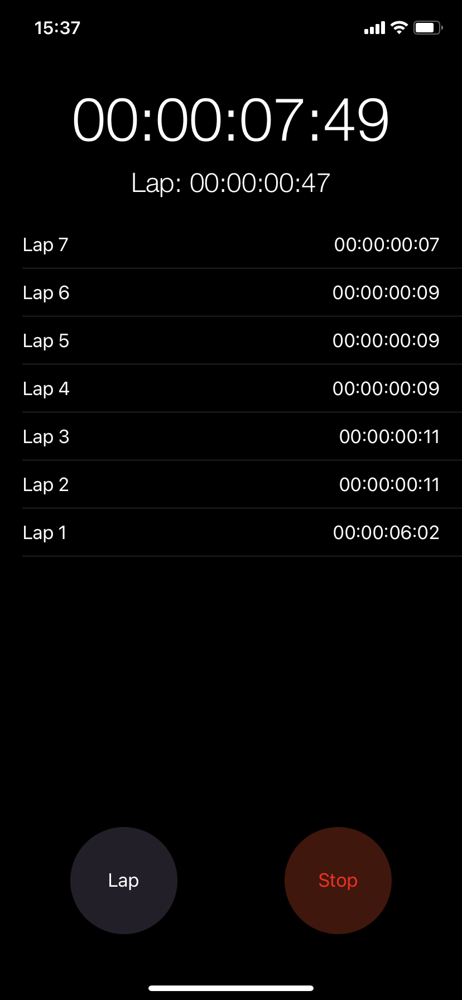
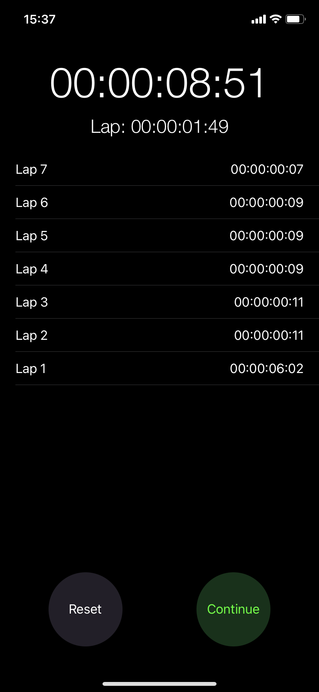

## StopwatchApp

Stopwatch is a simple app built using Swift. You can track the elapsed time, add laps, and start, stop and reset timer.

&nbsp;
&nbsp;
&nbsp;
 

### Used Technologies

- Timer
- Timer Format

### Used Technologies

- Start / Pause Timer
- Reset Timer
- Multiple Timer for Lap Count

### Requirements

- iOS 13.0+
- Xcode 13+
- Swift 5+

### Authors
-Umut Can Arslan [Linked.in](https://www.linkedin.com/in/umutcanarslan/)
